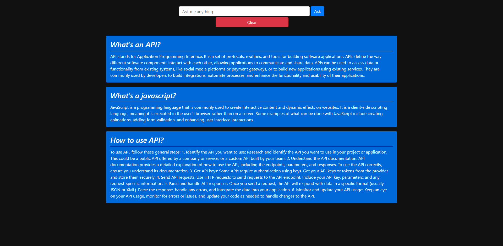

# ChatGPT-API-usage
It's an easy example of ChatGPT API usage.

# 📚 How To Use 📚
1. npm install
2. Create .env file and fill it using this template:
```
OPENAI_API_KEY=[api_key]
PORT=[port]
```

# 📷 Preview 📷
